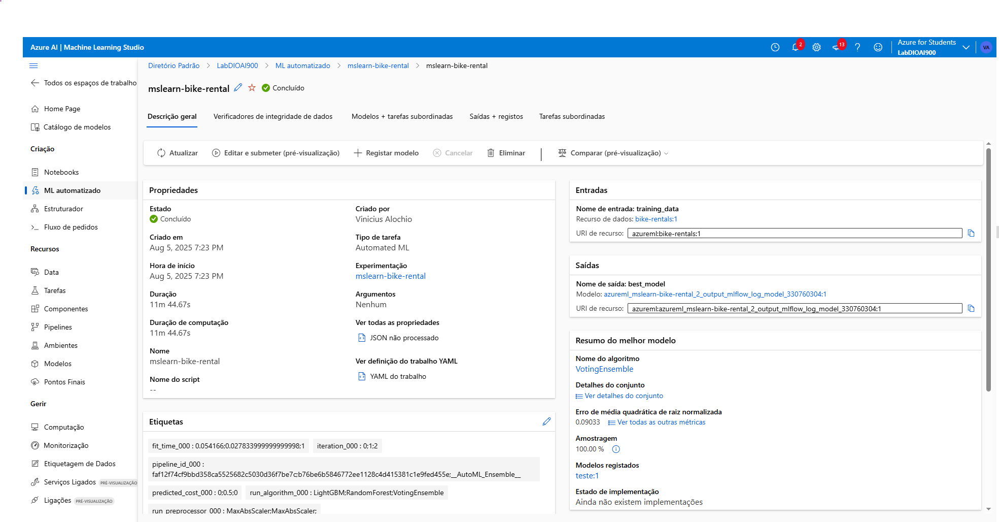
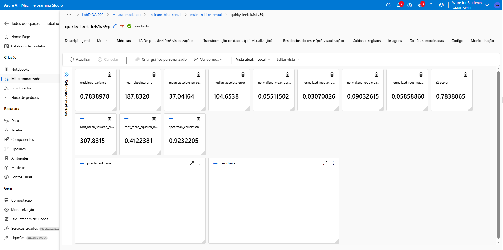

# Azure Machine Learning - Automated ML: Bike Rental Prediction 🚲📊

Este projeto demonstra o uso do **Azure Machine Learning Studio** com **Machine Learning Automatizado (AutoML)** para treinar, avaliar, implantar e testar um modelo de regressão capaz de prever o número de aluguéis de bicicleta com base em dados históricos e meteorológicos.

## 📌 Objetivo

Prever o número esperado de aluguéis de bicicleta em um determinado dia com base em variáveis sazonais e meteorológicas, utilizando o recurso de **Automated ML** do Azure.

---

## 🧠 Etapas do Projeto

### 1. Criar um Workspace no Azure ML

- Acesse: https://portal.azure.com
- Crie um recurso do tipo **Machine Learning**.
- Preencha com:
  - Grupo de recursos
  - Nome único para o workspace
  - Região: *East US*
  - Recursos padrões (armazenamento, key vault, etc.)

### 2. Acessar o Azure ML Studio

- URL: [https://ml.azure.com](https://ml.azure.com)
- Selecione o workspace criado.
- Vá até **ML Automatizado** no menu lateral.

---

## 🤖 Configurar e Executar um Experimento AutoML

### Informações Gerais

- **Nome do experimento**: `mslearn-bike-rental`
- **Tipo de tarefa**: Regressão
- **Métrica primária**: `NormalizedRootMeanSquaredError`

### Dataset

- Nome: `bike-rentals`
- Tipo: Tabela (mltable)
- Fonte: Arquivos locais com dados históricos (via [este link](https://aka.ms/bike-rentals))

### Configurações

- Algoritmos permitidos: `RandomForest` e `LightGBM`
- Número máximo de tentativas: 3
- Número de execuções simultâneas: 3
- Validação: Train-validation split (10%)
- Recurso computacional: **Serverless CPU (Standard_DS3_v2)**

---

## ✅ Resultados

Após o treinamento:

| Métrica                         | Valor       |
|-------------------------------|-------------|
| R² Score                      | 0.7838865   |
| Erro Absoluto Médio (MAE)     | 187.83      |
| RMSE                          | 307.83      |
| RMSE Normalizado              | 0.0903      |
| Correlação de Spearman        | 0.9232      |

---

## 🚀 Implantar o Modelo

- Vá até a aba **Modelos**
- Selecione o melhor modelo e clique em **Implantar**
- Configurações:
  - Tipo: **Real-time endpoint**
  - VM: `Standard_DS3_v2`
  - Contagem de instâncias: 3

---

## 🧪 Testar o Modelo Implantado

JSON de entrada para teste:

```json
{
  "input_data": {
    "columns": [
      "day", "mnth", "year", "season", "holiday", 
      "weekday", "workingday", "weathersit", 
      "temp", "atemp", "hum", "windspeed"
    ],
    "index": [0],
    "data": [[1,1,2022,2,0,1,1,2,0.3,0.3,0.3,0.3]]
  }
}
```

Resposta esperada (número previsto de aluguéis):
```json
[
  352.3564674945718
]
```

---

## 📌 Conclusão
Você utilizou um dataset de aluguéis de bicicletas históricos para treinar um modelo via AutoML no Azure. O modelo foi treinado, avaliado e implantado com sucesso, e já está respondendo previsões com base em dados meteorológicos e sazonais.

---

## 🖼️ Resultados




